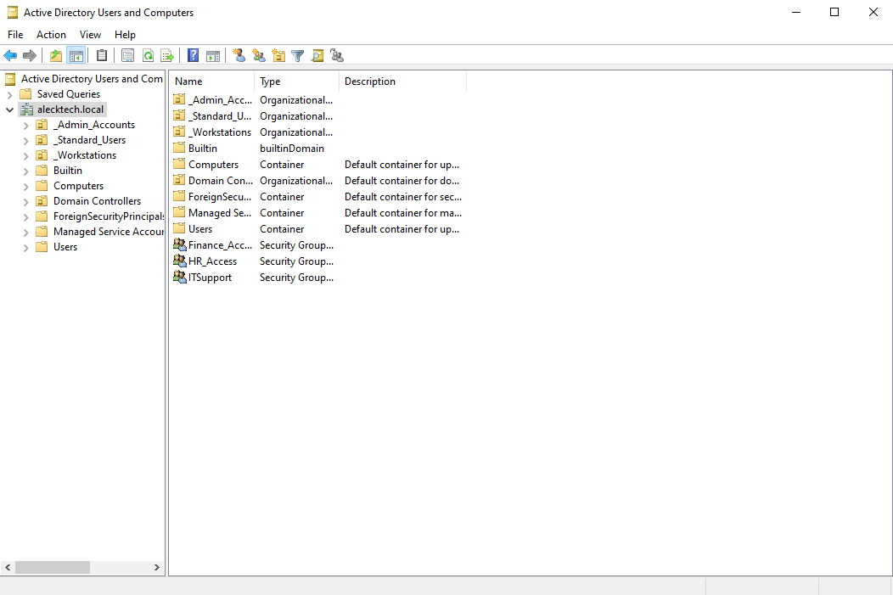
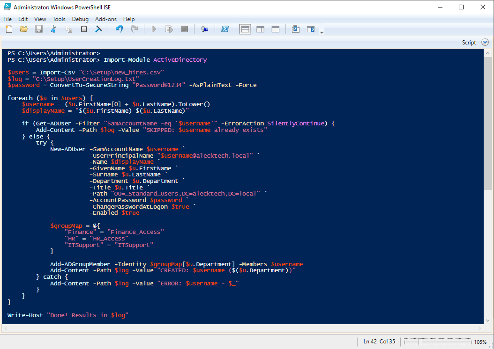
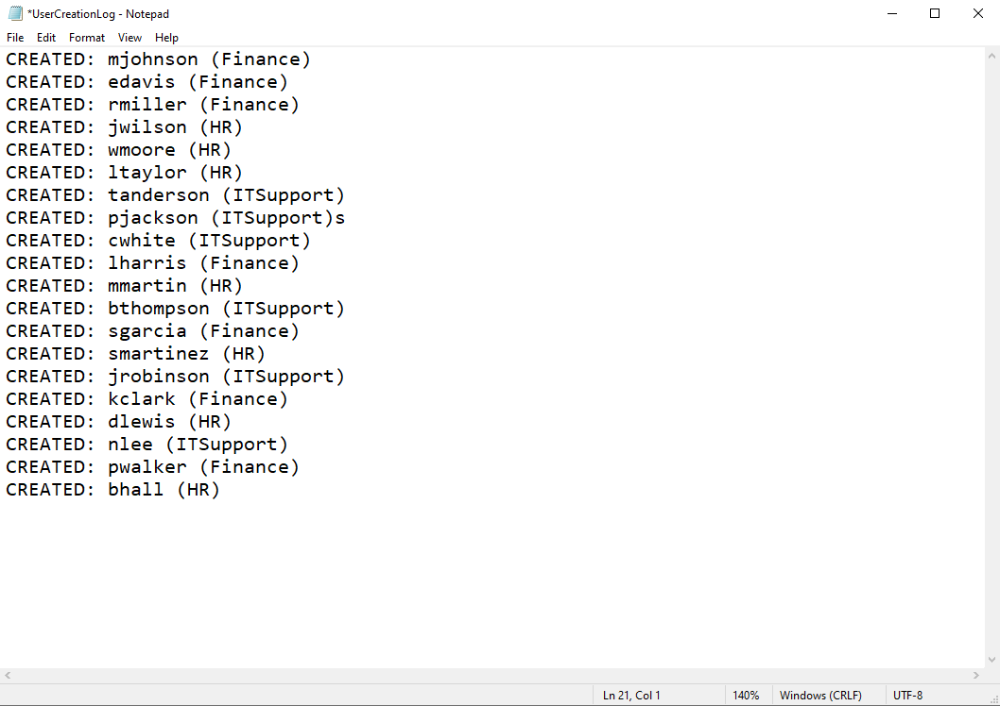
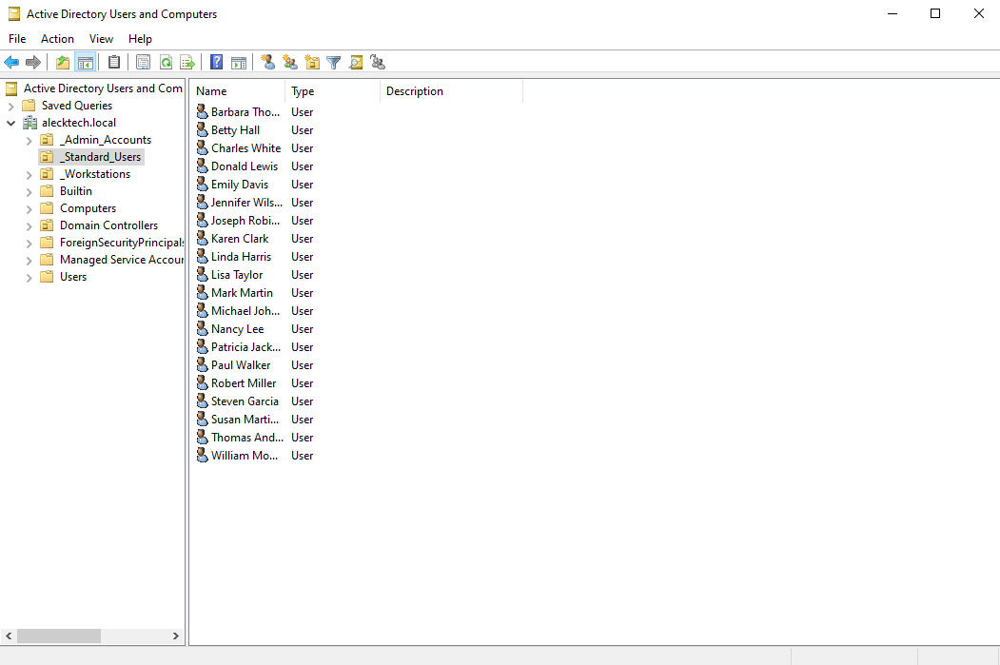
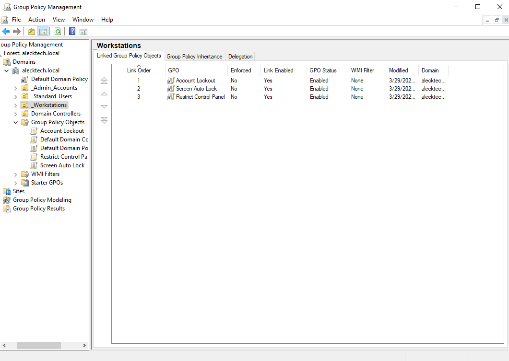
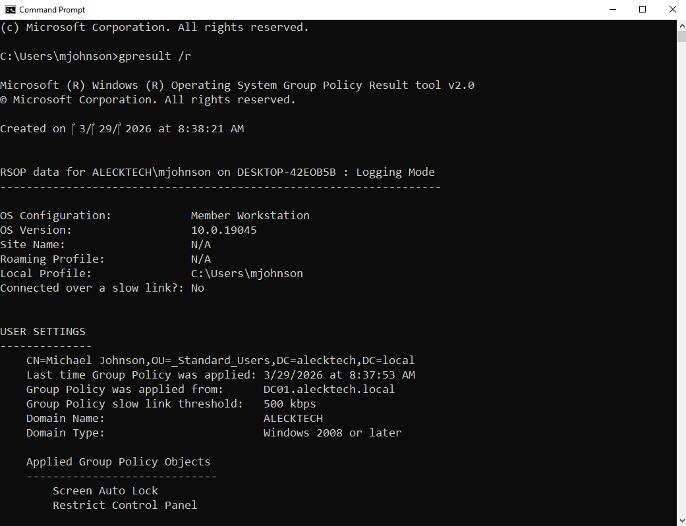
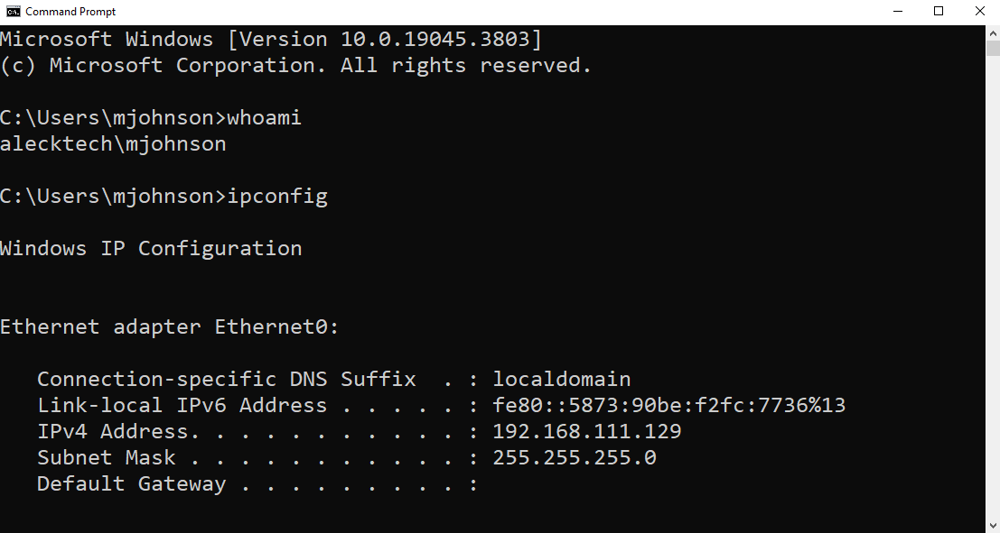
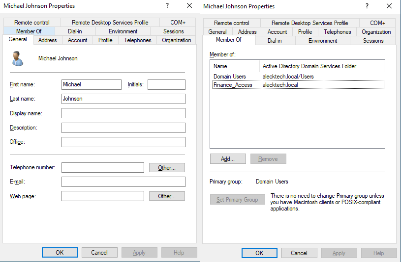
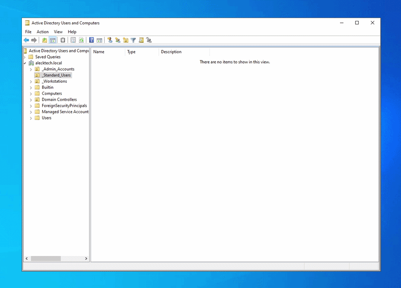
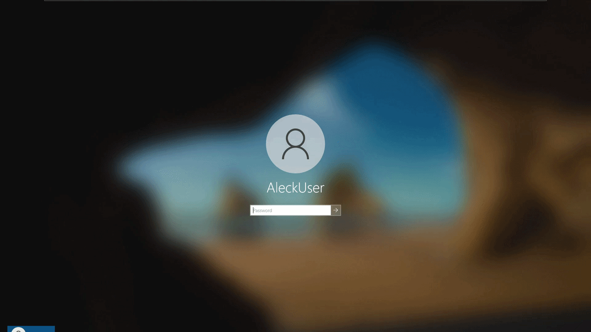

# Active Directory Home Lab

A simulated enterprise IT environment built to practice real world Active Directory administration, Powershell automation, and Group policy management.

/  /  /  /  /

## What This Is

I built this lab to simulate what an IT technician would set up on day one at a mid sized company. Instead of solely following a basic tutorial I tried to mirror how real enterprise environments are actually structured; with the use of proper naming conventions, a modular Group Policy, and automated bulk account creation. 

**Company:** Aleck Tech  
**Domain:** `alecktech.local`  
**Domain Controller:** `DC01`  
**Client Machine:** `CLIENT01` running Windows 10  
**Virtualization:** VMware Workstation Pro (Windows Server 22)  

---

## Environment Structure

I organized Active Directory around administrative boundaries rather than company departments. The OUs are for applying Group Policy and assigning permissions, not for mirroring an org chart.

**Organizational Units**
- `_Admin_Accounts` — privileged IT accounts with elevated permissions
- `_Standard_Users` — all regular employees
- `_Workstations` — domain joined computers

**Security Groups**
- `Finance_Access` — access to Finance resources
- `HR_Access` — access to HR resources
- `ITSupport` — role based permissions for IT support staff

*Custom OUs sorted to the top automatically using udnerscore prefix at the start. Each one serves a specific administrative purpose.*

/  /  /  /  /

## Bulk Account Creation

Instead of manually creating accounts one by one I wrote a PowerShell script that reads a CSV of new hires and handles everything automatically. It generates usernames, creates accounts with a temporary password that expires on first login, assigns each person to the right security group based on their department, and logs every result. If a username already exists it skips it and logs it instead of crashing.

*Script reads from a CSV and creates all 20 accounts automatically, no manual clicking.*

*Every account creation logged as an audit trail. Skips duplicates instead of crashing.*

*All 20 employees created and placed into the _Standard_Users OU after one script run.*

/  /  /  /  /

## Group Policy Objects

Three separate GPOs linked to the `_Workstations` OU. I did not touch the Default Domain Policy because modifying it can complicate everything if something breaks.

- `Account Lockout` — locks account after 5 failed login attempts
- `Screen Auto Lock` — workstation locks after 15 minutes of inactivity
- `Restrict Control Panel` — prevents standard users from changing the system settings

*Three separate GPOs linked to _Workstations. Default Domain Policy was never touched.*

*Proof the policies are actually running on the client machine, not just sitting on the server.*

/  /  /  /  /

## Verification

Joined a Windows 10 VM to the domain and confirmed everything was working from the end user side.

*Logged in as a domain user, mjohnson. Domain name confirms this is a domaina ccount, not a local one*

*Name, department, and group membership all populated automatically by the Powershell script.*

/  /  /  /  /

## Why I Built It This Way

**Separate GPOs instead of Default Domain Policy**  
If something breaks in the Default Domain Policy it affects all of the object in the domain and is painful to troubleshoot. Separate GPOs mean I can edit or remove one policy without touching anything else.

**OUs based on function not departments**  
Departments can change and as a result, people move roles. If the OU structure mirrors the org chart then you are constantly having to reorganize it. Security Groups handle departmental access, OUs handle administrative control.

**PowerShell over manual account creation**  
Clicking through menus to manually create 20 accounts one by one is not scalable and would take too much time. The script handles the bulk user creation in seconds with an audit log, which is closer to how a real IT department would handle new hire onboarding.

**Moved CLIENT01 to _Workstations before applying GPOs**  
When a computer joins the domain it lands in default Computers, not in any custom OU. Any group policies linked to _Workstations do nothing if the computer is still sitting in the wrong place. Moving it first was the fix.

/  /  /  /  /

## In Action

*Powershell script runs, log file confirms every account was created, Active Directory refreshes and all 20 users appear*

*Logging in as mjohnson for the first time. Temporary password expires immediately and a new one is required before accessing the desktop.*

/  /  /  /  /

## Runbook

Wrote a runbook to serve as documentation, similar to what you would find in a real IT department.

[User Account Management](IT-Runbook.md)

/  /  /  /  /

## Tools Used

VMware Workstation Pro, Windows Server 2022, Windows 10, PowerShell ISE, Active Directory Users and Computers, Group Policy Management Console, DNS Manager
